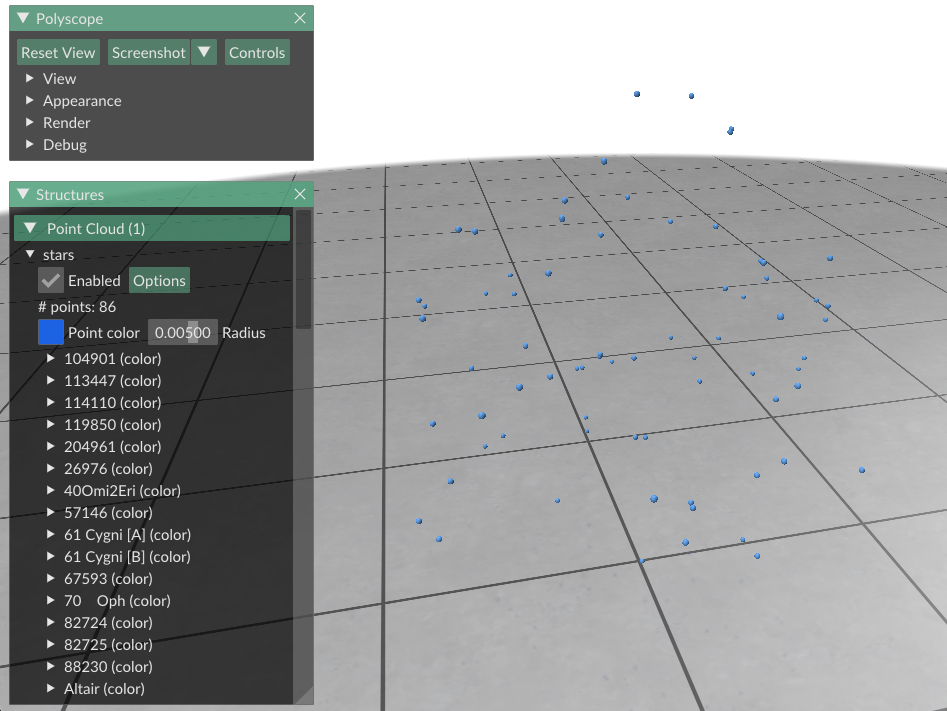
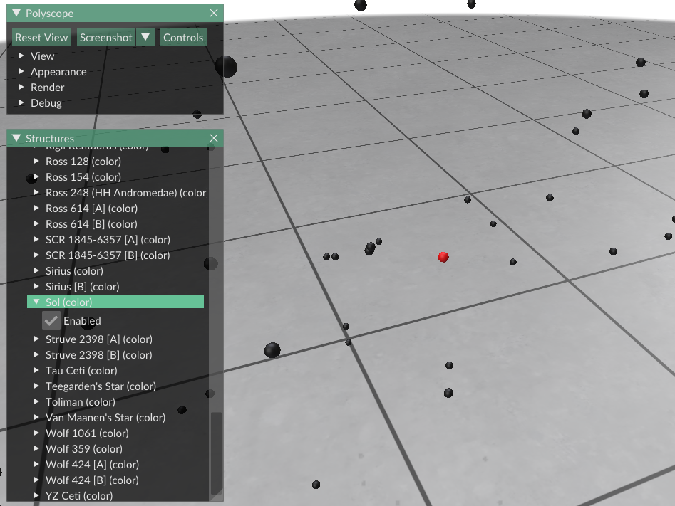

# 💫🔭 Nearby Habitable Planet Catalog (with visualizer!)

Python scripts that allow you to visualize nearby stars with habitable planets. It also lets you query the information on the command-line (CLI).

## Background

I built this tool for a sci-fi writing project. I wanted to find & visualize all discovered habitable planets within 18 light years of Earth (as of 2021). My story only took place within 18 light years of Earth, so I only took the time to catalog stars within that range.

## ⚠️ Disclaimer

I have not tested this outside of Apple Silicon. YMMV.

## Installation

Here's a quick guide on how to use this tool.

First, you'll need to clone the HYG Star Database. I included it as a submodule.

```bash
git submodule update --init
```

I used `pipenv` to manage installation ([link to pipenv docs](https://pipenv.pypa.io/en/latest/)). If you don't have it installed, please do so.

```bash
python3 -m pip install pipenv --user
```

Then run `pipenv install` within the project to create the virtualenv & install dependencies. It will also install the correct version of Python (if necessary). The neat part is that it will be completely isolated from other Python installations & virtualenvs, so no worries about clutter!
```bash
cd /path/to/project
python3 -m pipenv install
```


## Usage

NOTE: If you have not initialized the project, please see [Installation](#Installation).


Enter the `pipenv` shell.
```bash
cd /path/to/project
python3 -m pipenv shell
```

Now you can access the CLI. Note that you no longer need to use `python3` alias (which was a requirement for Mac users). The correct version should be aliased to `python`.

```bash
> python star_catalog/catalog.py --help
usage: catalog.py [-h] [--show] [--console] ly

return list of closest stars

positional arguments:
  ly          Distance from Earth in light years

optional arguments:
  -h, --help  show this help message and exit
  --show      Show stars in 3D
  --console   Open interactive session
```

### Arguments

#### `ly`
Distance from Earth in light years. Data is only accurate/complete up to ~18 ly.

#### `--show`
Display the stars in a 3D graph.

#### `--console`
Open up an interactive IPython session to play around with the data.


### Visualization

#### Visualizing all stars

All stars should be visible as blue dots. The sun (Sol) will be in the center of the point cloud.



Highlight a specific star by expanding it in the left view and clicking "Enabled". This will turn all other stars black and the star in question will turn red. In this case, I highlighted the sun (Sol).




## Future Goals

I'd love to fill this data beyond 18 light years. I'd also love to build a web app version that anyone can access.

## Resources

https://plotly.com/python/v3/3d-network-graph/


